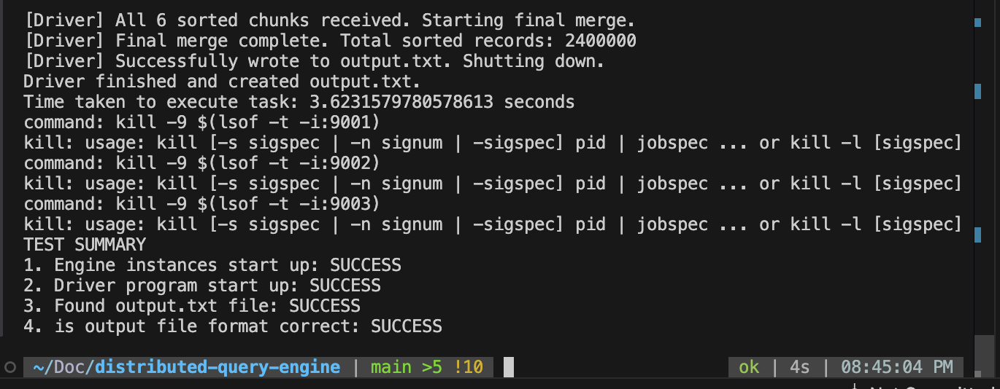

# Distributed Query Engine

## Requirements
- **Rust** (version 1.70 or newer recommended)
- **Python 3**

## Setup & Usage
1. **Add the dataset and assertion file:**
   - Place your `sample_dataset` folder (with CSV files) and `output_assertion.txt` in the project root.
2. **Build the Rust binaries:**
   ```sh
   cargo build --release
   ```
3. **Run the test automation:**
   ```sh
   python3 test_runner.py
   ```

## Project Overview
This project demonstrates a distributed sorting system using a dynamic worker queue architecture. The core idea is to split a large dataset (student rankings in CSV files) across multiple worker nodes (engines), each of which sorts its chunk independently. A central driver coordinates the process, distributes tasks dynamically to available workers, and merges the sorted results efficiently.

- **Driver:** Discovers CSV files, manages a dynamic queue of tasks, assigns work to engines as they connect, and merges sorted results using a k-way merge.
- **Engine:** Connects to the driver, requests tasks, sorts its assigned chunk, and sends the sorted data back.

This approach allows for flexible scaling: you can run as many engine workers as you like, and tasks are distributed dynamically based on worker availability.

## Design & Architecture (Why these choices?)
Rust is fast like C++, but safer and easier to write concurrent code.
The dynamic work queue keeps all engines busy and balances the load automatically.
You can add more engines any time—no code changes needed.
Merge sort in engines: always O(n log n), no surprises, even for weird data.
K-way merge in the driver: combines all sorted chunks in the fastest way possible.

## Result
After running the test runner, you should see a summary in the terminal showing the success of each step:


